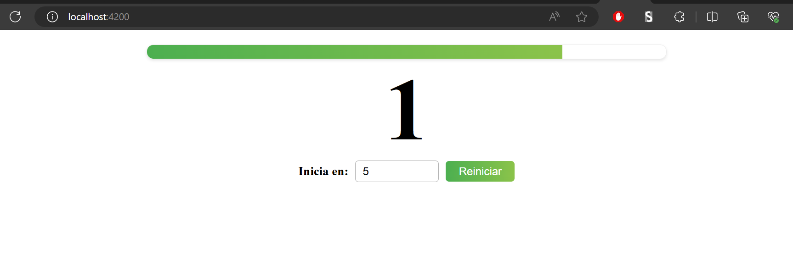
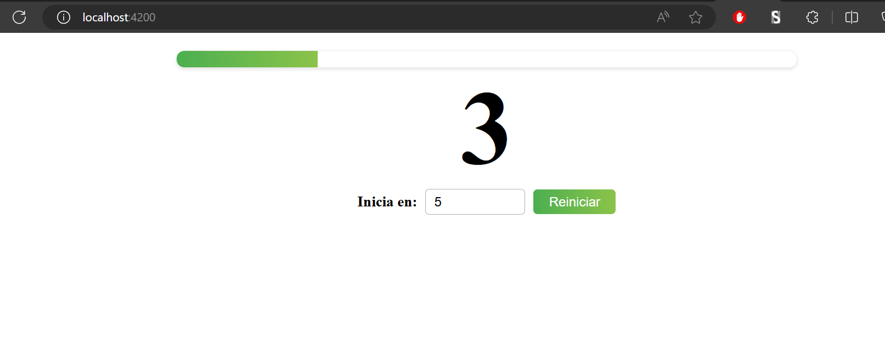

# **Select Language:** 🌍 
- [Español (Spanish)](README-es.md)
- [English](README.md)

# Componentes de Temporizador y Barra de Progreso

Este repositorio contiene dos componentes independientes de Angular: un temporizador de cuenta regresiva (`CountdownComponent`) y una barra de progreso (`ProgressBarComponent`). Estos componentes están integrados en la aplicación principal para proporcionar un temporizador visual de cuenta regresiva con una barra de progreso correspondiente.

## RESULTS
### Views
 
 
 

## Tabla de Contenidos
- [Instalación](#instalación)
- [Uso](#uso)
- [Componentes](#componentes)
  - [CountdownComponent](#countdowncomponent)
  - [ProgressBarComponent](#progressbarcomponent)
- [Aplicación Principal](#aplicación-principal)
- [Scripts](#scripts)
- [Dependencias](#dependencias)
- [Dependencias de Desarrollo](#dependencias-de-desarrollo)

## Instalación

Para instalar las dependencias necesarias, ejecuta:

```bash
npm install
```

## Uso

Para iniciar el servidor de desarrollo, ejecuta:

```bash
npm start
```

La aplicación estará disponible en `http://localhost:4200/`.

## Componentes

### CountdownComponent

El `CountdownComponent` es responsable de gestionar un temporizador de cuenta regresiva.

**Propiedades:**

- `@Input() init: number`: El valor inicial de la cuenta regresiva.
- `@Output() onDecrease: EventEmitter<number>`: Emite el valor actual de la cuenta regresiva en cada tick.
- `@Output() onComplete: EventEmitter<void>`: Emite cuando la cuenta regresiva llega a cero.

**Plantilla:**

```html
<div>
  {{counter}}
</div>
```

**Estilos:**

Agrega estilos en `countdown.component.scss`.

### ProgressBarComponent

El `ProgressBarComponent` muestra el progreso de la cuenta regresiva como un porcentaje.

**Propiedades:**

- `@Input() progress: number`: El porcentaje de progreso a mostrar.

**Plantilla:**

```html
<div [style.width.%]="progress"></div>
```

**Estilos:**

Agrega estilos en `progress-bar.component.scss`.

## Aplicación Principal

La aplicación principal integra el `CountdownComponent` y el `ProgressBarComponent`.

**Plantilla:**

```html
<h1>
  <app-progress-bar [progress]="counterProgress"></app-progress-bar>
  <app-countdown #countdown
    [init]="totalCountdown"
    (onDecrease)="updateProgress($event)"
    (onComplete)="countdownFinished()">
  </app-countdown>
  <div class="control-container">
    <label for="totalCountdown">Inicia en:</label>
    <input type="number" id="totalCountdown" maxlength="15" max="300000000" min="0" [(ngModel)]="totalCountdown" />
    <button (click)="countdown.startCounter(); counterProgress=0">Reiniciar</button>
  </div>
</h1>
```

**Estilos:**

Agrega estilos en `app.component.scss`.

**Lógica del Componente:**

```typescript
import { Component } from '@angular/core';
import { RouterOutlet } from '@angular/router';
import { FormsModule } from '@angular/forms';
import { ProgressBarComponent } from './components/progress-bar/progress-bar.component';
import { CountdownComponent } from './components/countdown/countdown.component';

@Component({
  selector: 'app-root',
  standalone: true,
  imports: [RouterOutlet, ProgressBarComponent, CountdownComponent, FormsModule],
  templateUrl: './app.component.html',
  styleUrl: './app.component.scss'
})
export class AppComponent {
  title = 'components';

  counterProgress: number = 0;
  totalCountdown: number = 5;

  updateProgress($event: number) {
    this.counterProgress = (this.totalCountdown - $event) / this.totalCountdown * 100;
  }

  countdownFinished() {
    console.log("Countdown Finished");
  }
}
```

## Scripts

- `ng`: Ejecutar comandos de Angular CLI.
- `start`: Iniciar el servidor de desarrollo.
- `build`: Construir la aplicación.
- `watch`: Construir la aplicación en modo de observación.
- `test`: Ejecutar pruebas.
- `serve:ssr:components`: Servir la aplicación con renderizado del lado del servidor.

## Dependencias

- `@angular/animations`
- `@angular/common`
- `@angular/compiler`
- `@angular/core`
- `@angular/forms`
- `@angular/platform-browser`
- `@angular/platform-browser-dynamic`
- `@angular/platform-server`
- `@angular/router`
- `@angular/ssr`
- `express`
- `rxjs`
- `tslib`
- `zone.js`

## Dependencias de Desarrollo

- `@angular-devkit/build-angular`
- `@angular/cli`
- `@angular/compiler-cli`
- `@types/express`
- `@types/jasmine`
- `@types/node`
- `jasmine-core`
- `karma`
- `karma-chrome-launcher`
- `karma-coverage`
- `karma-jasmine`
- `karma-jasmine-html-reporter`
- `typescript`

## Licencia

Este proyecto está licenciado bajo la Licencia MIT.
