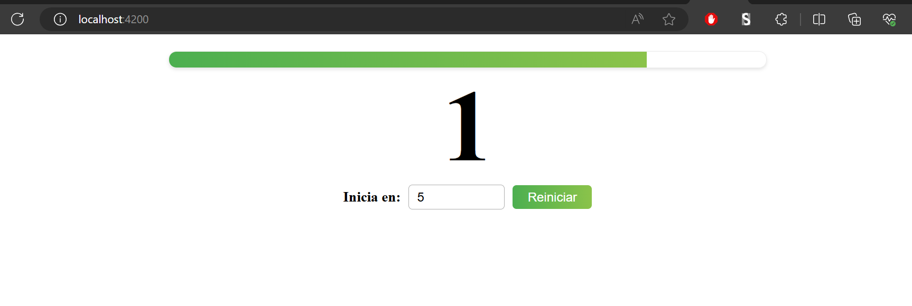
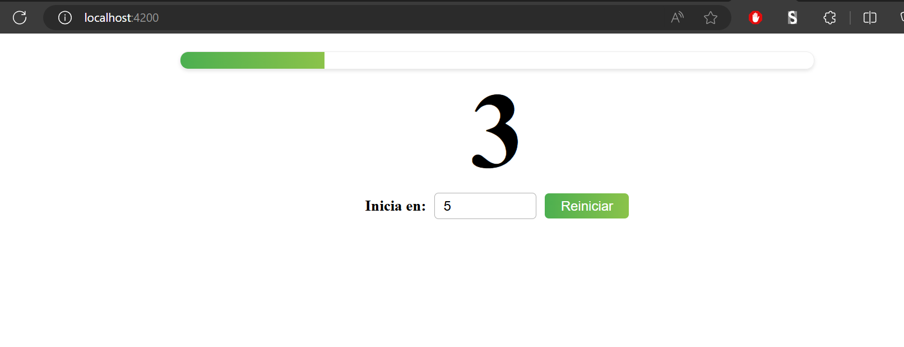
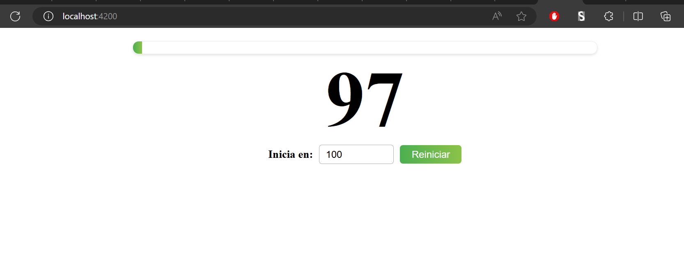

# Countdown and Progress Bar Components

This repository contains two Angular standalone components: a countdown timer (`CountdownComponent`) and a progress bar (`ProgressBarComponent`). These components are integrated into the main application to provide a visual countdown timer with a corresponding progress bar.

## RESULTS
### Views
 
 
 

## Table of Contents
- [Installation](#installation)
- [Usage](#usage)
- [Components](#components)
  - [CountdownComponent](#countdowncomponent)
  - [ProgressBarComponent](#progressbarcomponent)
- [Main Application](#main-application)
- [Scripts](#scripts)
- [Dependencies](#dependencies)
- [Development Dependencies](#development-dependencies)

## Installation

To install the necessary dependencies, run:

```bash
npm install
```

## Usage

To start the development server, run:

```bash
npm start
```

The application will be available at `http://localhost:4200/`.

## Components

### CountdownComponent

The `CountdownComponent` is responsible for managing a countdown timer.

**Properties:**

- `@Input() init: number`: The initial countdown value.
- `@Output() onDecrease: EventEmitter<number>`: Emits the current countdown value on each tick.
- `@Output() onComplete: EventEmitter<void>`: Emits when the countdown reaches zero.

**Template:**

```html
<div>
  {{counter}}
</div>
```

**Styles:**

Add styles in `countdown.component.scss`.

### ProgressBarComponent

The `ProgressBarComponent` displays the progress of the countdown as a percentage.

**Properties:**

- `@Input() progress: number`: The progress percentage to be displayed.

**Template:**

```html
<div [style.width.%]="progress"></div>
```

**Styles:**

Add styles in `progress-bar.component.scss`.

## Main Application

The main application integrates the `CountdownComponent` and `ProgressBarComponent`.

**Template:**

```html
<h1>
  <app-progress-bar [progress]="counterProgress"></app-progress-bar>
  <app-countdown #countdown
    [init]="totalCountdown"
    (onDecrease)="updateProgress($event)"
    (onComplete)="countdownFinished()">
  </app-countdown>
  <div class="control-container">
    <label for="totalCountdown">Inicia en:</label>
    <input type="number" id="totalCountdown" maxlength="15" max="300000000" min="0" [(ngModel)]="totalCountdown" />
    <button (click)="countdown.startCounter(); counterProgress=0">Reiniciar</button>
  </div>
</h1>
```

**Styles:**

Add styles in `app.component.scss`.

**Component Logic:**

```typescript
import { Component } from '@angular/core';
import { RouterOutlet } from '@angular/router';
import { FormsModule } from '@angular/forms';
import { ProgressBarComponent } from './components/progress-bar/progress-bar.component';
import { CountdownComponent } from './components/countdown/countdown.component';

@Component({
  selector: 'app-root',
  standalone: true,
  imports: [RouterOutlet, ProgressBarComponent, CountdownComponent, FormsModule],
  templateUrl: './app.component.html',
  styleUrl: './app.component.scss'
})
export class AppComponent {
  title = 'components';

  counterProgress: number = 0;
  totalCountdown: number = 5;

  updateProgress($event: number) {
    this.counterProgress = (this.totalCountdown - $event) / this.totalCountdown * 100;
  }

  countdownFinished() {
    console.log("Countdown Finished");
  }
}
```

## Scripts

- `ng`: Run Angular CLI commands.
- `start`: Start the development server.
- `build`: Build the application.
- `watch`: Build the application in watch mode.
- `test`: Run tests.
- `serve:ssr:components`: Serve the application with server-side rendering.

## Dependencies

- `@angular/animations`
- `@angular/common`
- `@angular/compiler`
- `@angular/core`
- `@angular/forms`
- `@angular/platform-browser`
- `@angular/platform-browser-dynamic`
- `@angular/platform-server`
- `@angular/router`
- `@angular/ssr`
- `express`
- `rxjs`
- `tslib`
- `zone.js`

## Development Dependencies

- `@angular-devkit/build-angular`
- `@angular/cli`
- `@angular/compiler-cli`
- `@types/express`
- `@types/jasmine`
- `@types/node`
- `jasmine-core`
- `karma`
- `karma-chrome-launcher`
- `karma-coverage`
- `karma-jasmine`
- `karma-jasmine-html-reporter`
- `typescript`

## License

This project is licensed under the MIT License.
